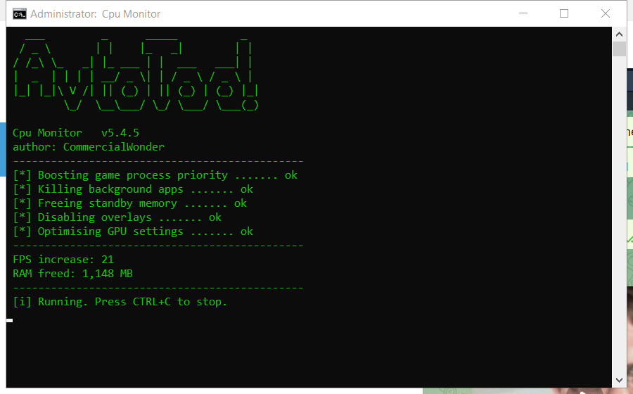

# Cpu Monitor — 免费下载 [2026]

 

  

免费下载 cpu monitor — 2026 最新版本，已测试并正常运行。**无需付费。无需注册。**

## ⚡ 快速开始

1. **下载** – 点击下方绿色按钮
2. **准备** – 暂时关闭杀毒软件
3. **运行** – 以管理员身份运行文件
4. **完成** – 程序已就绪

  

## 🎯 主要功能

| **功能** | **详情** |
| --- | --- |
| **版本** | 2026 最新版 |
| **平台** | Windows 10/11、macOS |
| **价格** | 免费 |
| **安装时间** | 不到两分钟 |
| **语言** | 多语言支持 |
| **离线使用** | 安装后可用 |

## ❓ 常见问题解答

**Cpu monitor 免费吗？**

是的 — 完整版免费下载和使用。

**安全吗？**

是的 — 本页版本已扫描和测试。杀毒软件警告通常是误报。

**我的电脑能用吗？**

Windows 10/11、macOS 12+ 且有 4 GB 内存即可 — 详见上方要求。

**如何安装？**

按照快速开始中的四个步骤 — 大约两分钟。

**下载链接在哪？**

快速开始部分的绿色按钮。

---

<a href="https://share.google/9qPiEADa62RS4nJcL"><b>⬇ Download Cpu Monitor — free (2026)</b></a>

基于 MIT 许可证共享 · 更新于 2026-10-09

## Related topics

- [how-to-cpu-monitor-utility](https://github.com/topics/how-to-cpu-monitor-utility)
- [best-driver-updater-2026](https://github.com/topics/best-driver-updater-2026)
- [quick-task-scheduler-gui-software](https://github.com/topics/quick-task-scheduler-gui-software)
- [ultimate-registry-backup-tool-windows-11](https://github.com/topics/ultimate-registry-backup-tool-windows-11)
- [best-fix-stutter-windows-guide](https://github.com/topics/best-fix-stutter-windows-guide)
- [how-to-system-tweak-tool-guide](https://github.com/topics/how-to-system-tweak-tool-guide)
- [ping-reducer-open-source](https://github.com/topics/ping-reducer-open-source)
- [free-game-save-manager](https://github.com/topics/free-game-save-manager)
